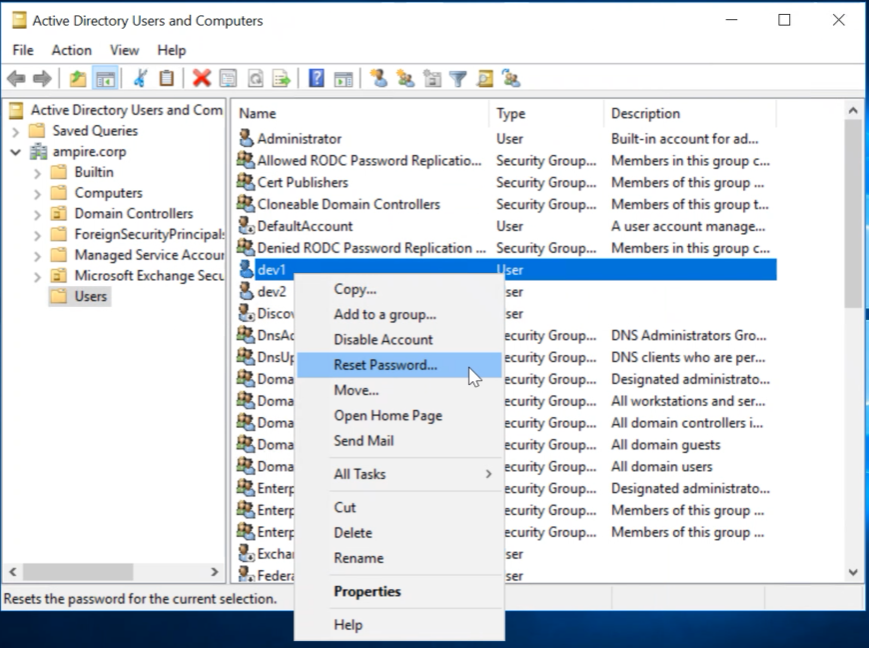
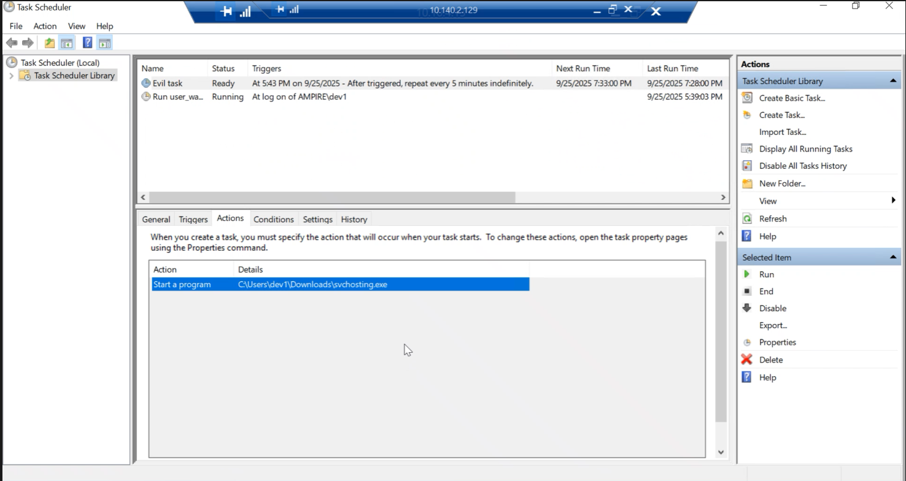
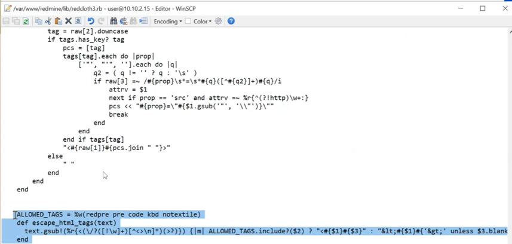
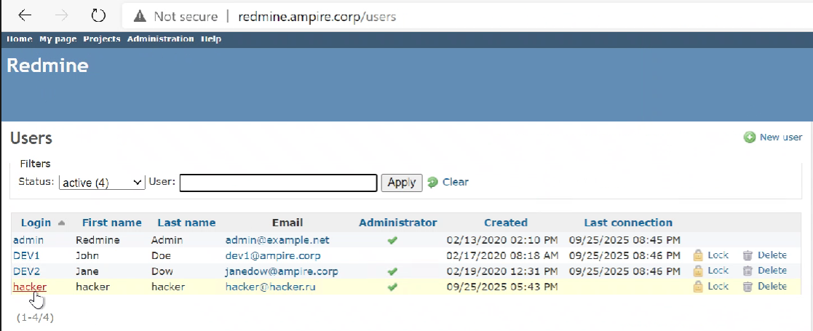

---
## Front matter
lang: ru-RU
title: Лабораторная работа №1
subtitle: Кибербезопасность предприятия
author:
  - Крутова Екатерина Дмитриевна, Прасолов Валерий Сернеевич | НПИ-22
institute:
  - Российский университет дружбы народов
  - Москва, Россия
date: 30.09.2025

## i18n babel
babel-lang: russian
babel-otherlangs: english

## Formatting pdf
toc: false
toc-title: Содержание
slide_level: 2
aspectratio: 169
section-titles: true
theme: metropolis
header-includes:
 - \metroset{progressbar=frametitle,sectionpage=progressbar,numbering=fraction}
 - '\makeatletter'
 - '\beamer@ignorenonframefalse'
 - '\makeatother'
---

## Цель лабораторной работы

Показать этапы реализации атак и контрмер в сценарии компрометации научно-технической информации предприятия, определить уязвимости, продемонстрировать доказательства успешной эксплуатации и предложить практические способы устранения.

## Теоретическое введение

**Сценарий №5**

Защита научно-технической информации предприятия. Внутренняя служба безопасности не смогла обнаружить в новом сотруднике специально подготовленного агента, который устроился в компанию для получения сведений, касающихся разработки новых насосных станций. Внутренний нарушитель проводит ряд успешных атак как на внутренних сотрудников компании, так и на сервера ЦОД. В результате он смог подключиться к внутренней базе данных и получить значения технических параметров работы новых насосных станций. Квалификация нарушителя высокая: он умеет использовать инструментарий для проведения атак, а также знает техники постэксплуатации.

## Ход выполнения лабораторной работы

## Уязвимости и последствия

- **Уязвимость 1:** Слабый пароль учётной записи `dev1` — позволяет перебор словарём.  
  **Последствие 1:** Developer backdoor — успешная загрузка и исполнение вредоносного файла, установка задачи в планировщике и Reverse Shell.

- **Уязвимость 2:** Stored XSS в Redmine (CVE-2019-17427) — позволяет исполнить вредоносный код через textile-разметку wiki.  
  **Последствие 2:** Создание административного пользователя Redmine и дальнейшее расширение привилегий.

- **Уязвимость 3:** Blind SQL (CVE-2019-18890) — позволяет извлечь защищённые данные по-символьным запросам с измерением времени ответа.

## Уязвимость 1 — слабый пароль

Для устранения уязвимости 1 мы сменили пароль у `dev1` на более сложный.

{#fig:001 width=50%}

## Решение последствия 1

Злоумышленник с помощью уязвимости добавил вредоносную нагрузку, которая создаёт задачу в Планировщике задач Windows для автозапуска `evil task`. Для устранения этого последствия мы удалили задачу.

{#fig:002 width=60%}

## Уязвимость 2 — XSS атака

Для устранения уязвимости 2 мы нашли обработку текста wiki-страниц в коде Redmine и обнаружили строчки, где RedCloth преобразует textile-разметку в HTML. Мы удалили тег `pre` из списка разрешённых тегов. После внесения изменений была перезапущена служба веб-сервера.

{#fig:003 width=60%}

## Решение последствий 2

В консоли администратора Redmine злоумышленником был создан аккаунт `hacker`. Для устранения последствия мы удалили данный аккаунт.

{#fig:004 width=60%}

## Уязвимость 3 — Blind SQL

Уязвимость связана с обработкой параметра `subproject_id` в файле `query.rb`. Для исправления мы нашли участок кода, передающий значения непосредственно в объектный запрос без фильтрации, добавили фильтрацию входных значений и закомментировали небезопасный код. После изменений была перезапущена служба веб-сервера командой:

