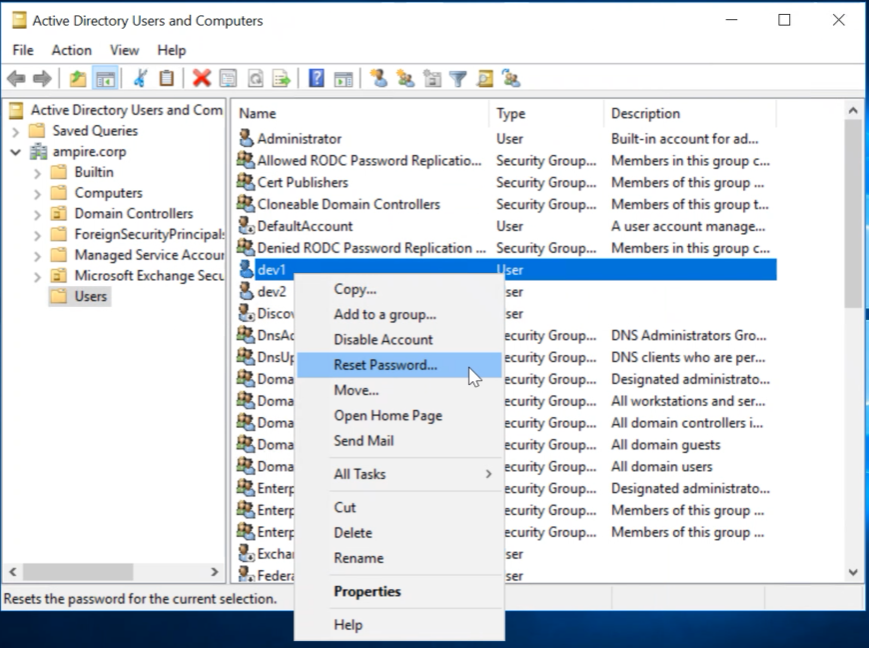
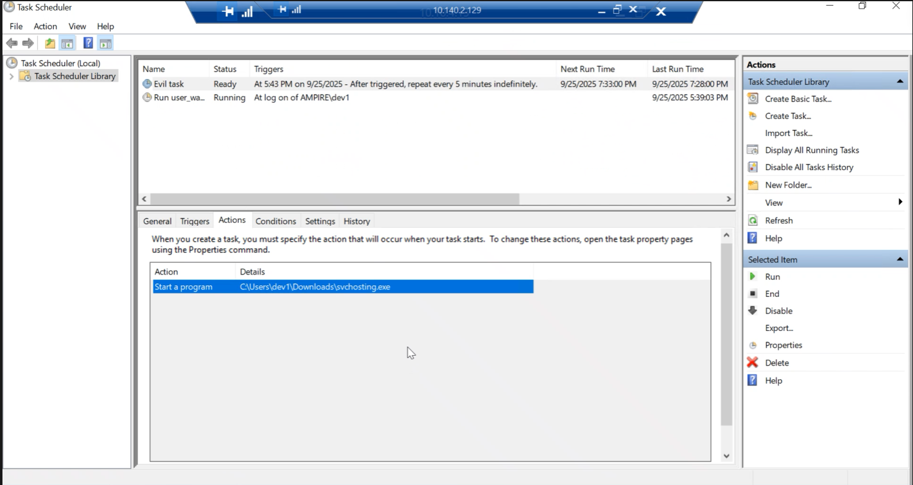
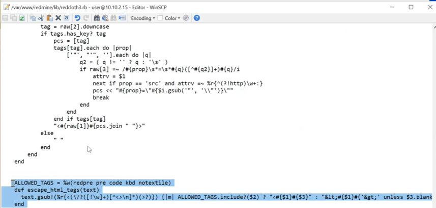
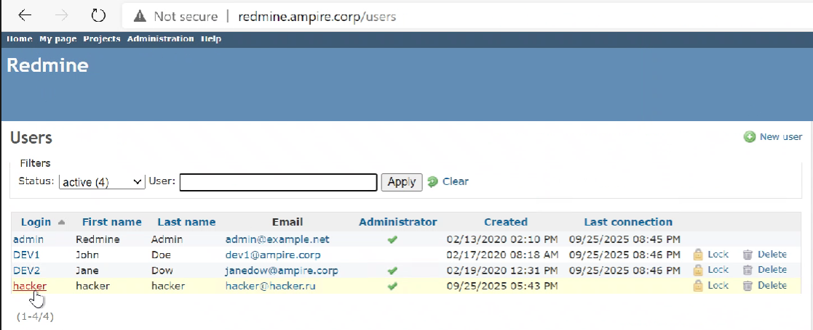
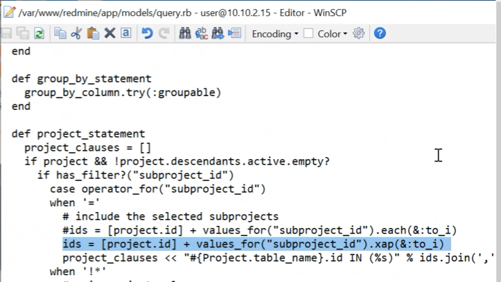

# Цель работы

Показать этапы реализации атак и контрмер в сценарии компрометации научно-технической информации предприятия, определить уязвимости, продемонстрировать доказательства успешной эксплуатации и предложить практические способы устранения.

# Теоретическое введение

Сценарий №5

Защита научно-технической информации предприятия Внутренняя служба безопасности не смогла обнаружить в новом сотрудники специально подготовленного агента, который устроился в компанию для получения сведений, касающихся разработки новых насосных станций. Внутренний нарушитель проводит ряд успешных атак как на внутренних сотрудников компании, так и на сервера ЦОД. В результате он смог подключиться к внутренней базе данных и получить значения технических параметров работы новых насосных станций. Квалификация нарушителя высокая. Он умеет использовать инструментарий для проведения атак, а также знает техники постэксплуатации.

Уязвимость 1: Слабый пароль учётной записи dev1 — позволяет перебор словарём.

Последствие 1: Developer backdoor — успешная загрузка и исполнение вредоносного файла, установка задачи в планировщике и Reverse Shell.

Уязвимость 2: Stored XSS в Redmine (CVE-2019-17427) — позволяет исполнить вредоносный код через textile-разметку wiki.

Последствие 2: Создание административного пользователя Redmine (Redmine User) и дальнейшее расширение привилегий.

Уязвимость 3: Blind SQL (CVE-2019-18890) — позволяет извлечь защищённые данные через по‑символьные запросы с измерением времени ответа.

# Выполнение лабораторной работы

Скриншоты экрана по шагам выполнения ЛР (рис. @fig:001). Дополнительные подробные пояснения к скриншотам, почему выполняли те или иные действия. В ЛР с Blue Team обязательны карточки инцидентов.

Для устранения уязвимости 1 мы сменили пароль у dev 1 на более сложный (рис. @fig:001).

{#fig:001 width=90%}

Злоумышленник с помощью уязвимости добавил вредоносную нагрузку, которая создаёт задачу в Планировщике задач Windows для автозапуска evil task (рис. @fig:002). Для устранения этого последствия мы удалили задачу.

{#fig:002 width=90%}

Уязвимость 2:

Для устранения уязвимости 2 мы нашли обработку текста wiki-страниц в коде Redmine и обнаружили строчки, где RedCloth преобразует textile-разметку в HTML. Мы удалили тег pre из списка разрешённых тегов (рис. @fig:003). После внесения изменений была перезапущена служба веб-сервера.

{#fig:003 width=90%}

Последствие 2:

В консоли администратора Redmine злоумышленником был создан аккаунт hacker (рис. @fig:004). Для устранения последствия мы удалили данный аккаунт.

{#fig:004 width=90%}

Последствие 3:

Последняя уязвимость связана с обработкой параметра subproject_id в файле query.rb. Для исправления мы нашли участок кода, передающий значения непосредственно в объектный запрос без фильтрации и добавили фильтрацию входных значений, закомментировали небезопасный код. После была перезапущена служба веб-сервера: sudo systemctl restart nginx.service.

{#fig:005 width=90%}

# Вывод

В ходе выполнения данной лабораторной работы был изучен сценарий атаки на систему защиты научно‑технической информации предприятия и способы её нейтрализации. Было рассмотрено, как цепочка уязвимостей может привести к компрометации данных, и какие меры позволяют устранить последствия.

# Список литературы
