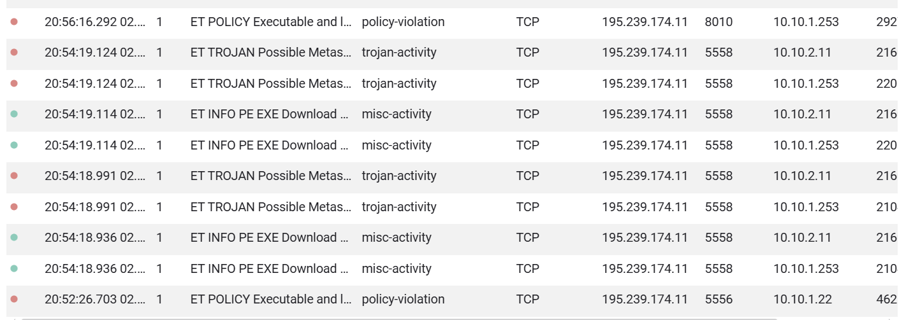
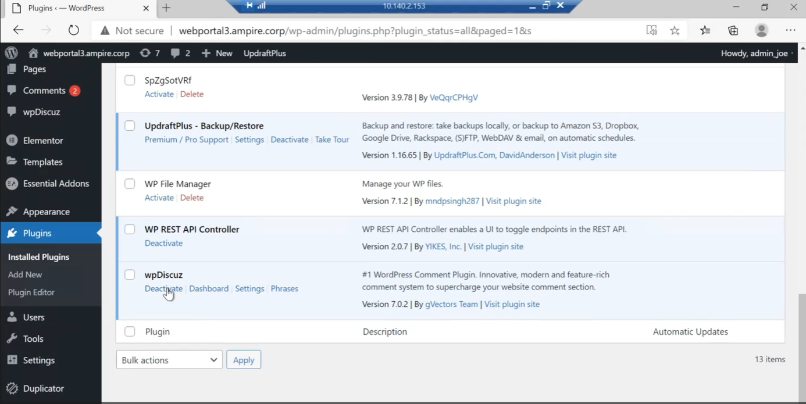
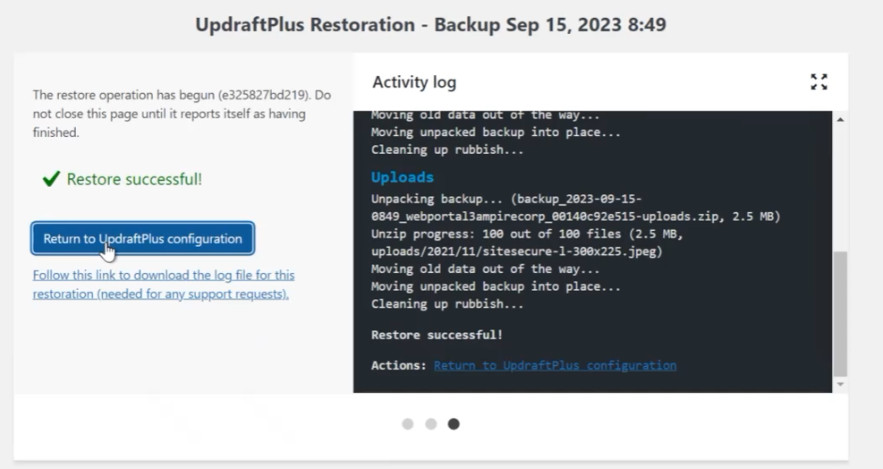
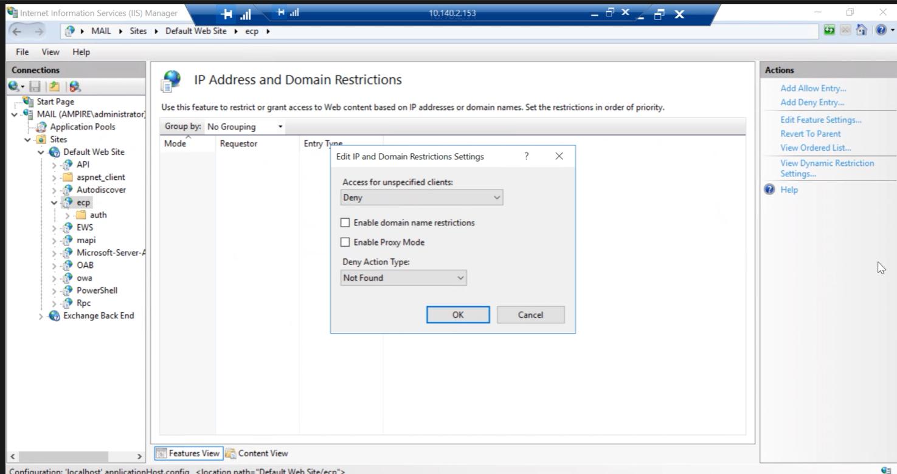
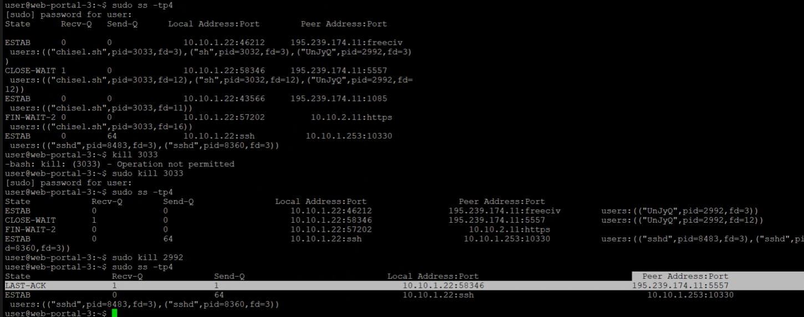
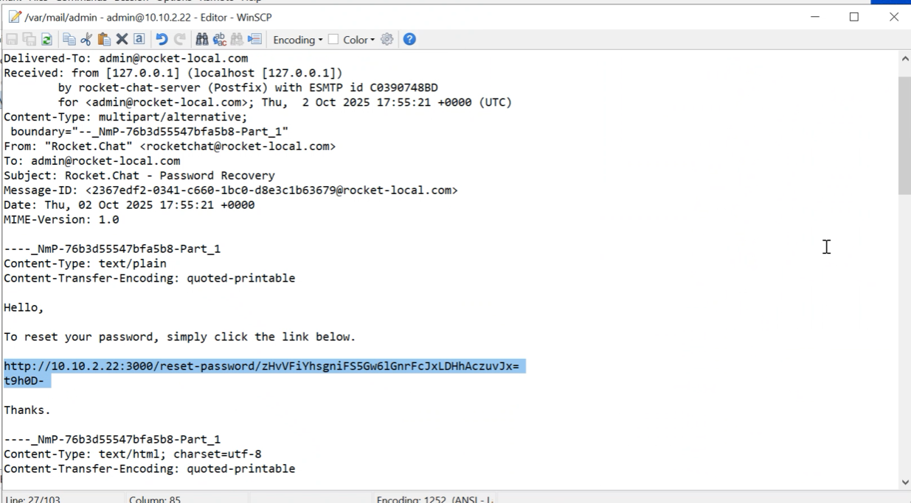
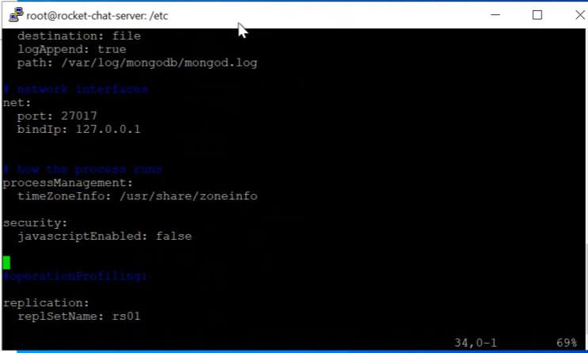

---
## Front matter
lang: ru-RU
title: Лабораторная работа №2
subtitle: Кибербезопасность предприятия
author:
  - Крутова Екатерина Дмитриевна, Прасолов Валерий Сергеевич | НПИ-22
institute:
  - Российский университет дружбы народов
  - Москва, Россия
date: 30.09.2025

## i18n babel
babel-lang: russian
babel-otherlangs: english

## Formatting pdf
toc: false
toc-title: Содержание
slide_level: 2
aspectratio: 169
section-titles: true
theme: metropolis
header-includes:
 - \metroset{progressbar=frametitle,sectionpage=progressbar,numbering=fraction}
---

## Цель лабораторной работы

Показать этапы реализации атак и контрмер в сценарии защиты корпоративного мессенджера, определить уязвимости, продемонстрировать доказательства успешной эксплуатации и предложить практические способы устранения.

## Теоретическое введение

**Сценарий №5**

Легенда: защита корпоративного мессенджера

Конкуренты решили скомпрометировать деятельность Компании и нашли для этого исполнителя. Злоумышленник находит в Интернете сайт соответствующего предприятия и решает провести атаку на него с целью получения доступа к внутренним ресурсам. Проэксплуатировав обнаруженную на сайте уязвимость, нарушитель стремится захватить управление другими ресурсами защищаемой сети, в том числе, пытается закрепиться на почтовом сервере и продолжить атаку. Главная задача злоумышленника — получение доступа к переписке сотрудников компании, раскрытие учётных данных пользователей, зарегистрированных в приложении корпоративного мессенджера, с целью использования их для нанесения ущерба репутации конкурирующей компании. Квалификация нарушителя высокая. Он умеет использовать инструментарий для проведения атак, а также знает техники постэксплуатации.

## Ход выполнения лабораторной работы

**Обнаружение атак:**

{#fig:001 width=70%}

## Уязвимости и последствия

- **Уязвимость 1:** WordPress-wpDiscuz (CVE-2020-24186) — критическая уязвимость в плагине wpDiscuz (версии 7.0 — 7.0.4), позволяющая неаутентифицированному пользователю загружать любые файлы через уязвимый AJAX-эндпоинт (включая PHP).  
  **Последствие 1:** Deface.

- **Уязвимость 2:** Proxylogon (CVE-2021-27065) — при наличии аутентификации (или после обхода через другие уязвимости) злоумышленник мог записать произвольный файл на сервер Exchange и добиться RCE.  
  **Последствие 2:** Exchange China Chopper.

- **Уязвимость 3:** Rocket.Chat (CVE-2021-22911, CVE-2022-0847) — уязвимость в Rocket.Chat: недостаточная санация входа, приводящая к NoSQL-инъекции в неаутентифицированном API, что могло позволить похищение токенов сброса пароля и захват админского аккаунта.  
  **Последствие 3:** Meterpreter.

## Уязвимость 1

Для устранения уязвимости 1 мы деактивировали WordPress.

{#fig:003 width=80%}

## Решение последствия 1

Для нейтрализации данной полезной нагрузки необходимо сформировать резервную копию с помощью плагина Updraft Backup/Restore.

{#fig:004 width=80%}

## Уязвимость 2

Для устранения уязвимости 2 мы ограничили доступ к указанной директории для запрета эксплуатации уязвимости:

{#fig:005 width=80%}

## Решение последствий 2

Для устранения полезной нагрузки мы удалили файл веб-оболочки по пути  
`C:\Program Files\Microsoft\Exchange Server\V15\FrontEnd\HttpProxy\..\auth\`  
и завершили все соединения между уязвимой машиной и нарушителем.

{#fig:006 width=70%}

## Уязвимость 3

Для восстановления доступа к аккаунту администратора необходимо сбросить пароль.

{#fig:007 width=60%}

Изменив пароль, мы отредактировали файл конфигурации БД `/etc/mongod.conf`.

{#fig:008 width=60%}

## Решение последствий 3

Данная полезная нагрузка заключается в получении нарушителем meterpreter-сессии с уязвимым сервером.  
Её можно обнаружить и устранить (рис. @fig:020).

{#fig:009 width=90%}
